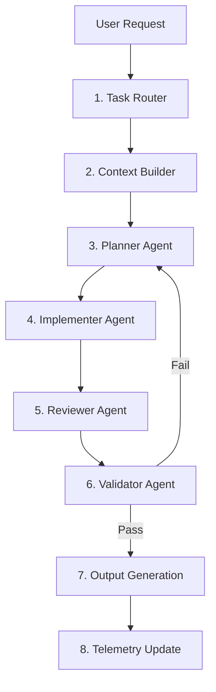

# 🔄 PIPELINE WORKFLOW (PRODUCTION v3)

This workflow defines the execution pipeline for all tasks. No step may be skipped.

---

## 1. FULL PIPELINE STEPS

### STEP 1: TASK ROUTING
- **Call**: `task_router.md`
- **Actions**: Classify the task (BUG, FEATURE, REFACTOR, DEBUG, UI) and risk level.
- **Rules**: No code generation or file reads.

### STEP 2: CONTEXT BUILDING
- **Call**: `context_builder.md`
- **Actions**: Query `file_index.md` to map paths under `lib/`. Retrieve code blocks and check dependencies.
- **Rules**: Do not scan the entire project. Retrieve raw target code blocks, and trim dependencies to minimal signatures to conserve tokens.

### STEP 3: EXECUTION PLANNING
- **Call**: `planner_agent.md`
- **Actions**: Break down the task into discrete, minimal steps. Check existing styling structure to plan for design consistency.
- **Rules**: Plan only. No code generation.

### STEP 4: CODE EXECUTION
- **Call**: `implementer_agent.md`
- **Actions**: Write code changes matching the plan and target context.
- **Rules**: Execute minimal edits using `diff_engine.md` standards. If files or features are added, renamed, or deleted, generate updates for `file_index.md` or `README.md` concurrently.

### STEP 5: LOGICAL REVIEW
- **Call**: `reviewer_agent.md`
- **Actions**: Inspect implementation for logical bugs, edge cases, and architectural/styling consistency with existing UI components.
- **Rules**: Reject if logical bugs, style violations, or structural mismatches are found.

### STEP 6: SAFETY & SYNC VALIDATION (FINAL GATE)
- **Call**: `validator_agent.md`
- **Actions**: Validate compliance with `anti_drift_guard.md` (no scope creep, no boundary breaches) and `module_graph.md`.
- **Sync & Design Checks**:
  1. **Documentation Sync**: Confirm that any modified, deleted, or added feature/file has been correctly updated in `file_index.md` and `README.md`.
  2. **Design Coherence**: Confirm that the visual styling matches existing page designs.
- **Rules**: Reject and loop back if safety boundaries are violated or documentation is out-of-sync.

### STEP 7: OUTPUT GENERATION
- **Call**: `agent.md` Output Contract
- **Actions**: Output clean patch/diff blocks for code modifications, alongside any synced modifications to `file_index.md` or `README.md`.
- **Rules**: Print minimal bullet explanation. No extra preambles.

### STEP 8: TELEMETRY UPDATE
- **Call**: `telemetry_and_learning.md`
- **Actions**: Log execution statistics (lines modified, execution time, token sizes, pass/fail state) into `.agent/telemetry_cache.json`.
- **Rules**: Do not modify static markdown instructions.
